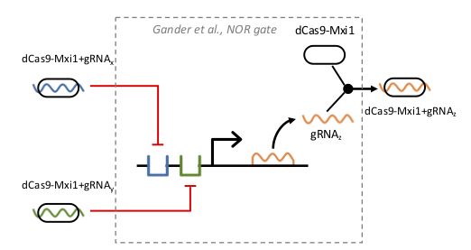

SEP 038 -- Merging ComponentDefinition and ModuleDefinition through Inheritance Pattern
===================================

SEP                     | 038
----------------------|--------------
**Title**                | Merging ComponentDefinition and ModuleDefinition through Inheritance Pattern
**Authors**           | Bryan Bartley (<bartleyba@sbolstandard.org>)
**Editor**            |  
**Type**               | Data Model
**SBOL Version** | 2.4/3.0
**Replaces**        | 
**Status**             | Draft
**Created**          | 28-August-2019
**Last modified**  | 

## Abstract

This proposal will make `ModuleDefinition` a subclass of `ComponentDefinition`, effectively merging `ModuleDefinition` into `ComponentDefinition`. This change is intended for the 3.0 milestone, but if necessary there is a migration path though 2.4

## Motivation <a name='motivation'></a>

The goal here is in keeping with the spirit of SEP035, and all of the following (quoted from that SEP) still applies:

> ...the boundary between structural and functional composition is often unclear, and can cause miscategorizations that are problematic to correct.  For example, we are using `ModuleDefinition` to represent mixtures (e.g., growth media) while `ComponentDefinition` is used to represent covalently bonded structures (e.g., DNA, pure chemicals).

> In short, there doesn't seem to be any value to separating structure and function, so we are going to let one object contain both types of information.

Another important point that distinguishes the approach advocated in this SEP compared with SEP035 is that it help harmonize the SBOL data model with SBOL visual, so that the semantics map better from one standard to another. This is demonstrated in the provided Example below. Unlike SEP035, which eliminates `ModuleDefinitions` altogether, this proposal allows us to retain a `ModuleDefinition` class, while correcting some of its problems. In SBOL Visual, a module is represented by a box, often with dashed lines, that groups subcomponents into an abstraction hierarchy. This SEP provides a simplified and unambiguous specification that will help automated visualization tools to interpret SBOL data and render a diagram with the appropriate visual semantics.  

A natural language description of the conceptualization offered by this proposal is as follows:

_A module is a component of a system that has a specified functional interaction with other components through an interface of inputs and outputs._

This conceptualization is quite easy to understand, consistent with an engineer's understanding of the concept of modularity, and easy to explain to new users, reviewers, and the synthetic biology community.

## Specification <a name='specification'></a>


**Figure 1:** Diagram of `ModuleDefinition` class as subclass of `ComponentDefinition`

### Adjustments to Component

- The `definition` property of `Component` can now reference either a `ComponentDefinition` or `ModuleDefinition`, thus integrating the previously separate structural and functional hierarchies into a single hierarchy.
- The `direction` field is moved from `FunctionalComponent` to `Component`

### Adjustments to FunctionalComponent

- `FunctionalComponent` is deprecated

### Adjustments to ModuleDefinition

- `ModuleDefinition` is subclassed from `ComponentDefinition`
- The `modules` property is deprecated. The `components` property is used instead for hierarchical composition.
- The `functionalComponents` property is deprecated.
- The `types` property remains an optional field, unlike the superclass, `ComponentDefinition`

### Adjustments to Participation

For `Participation` objects, the `participant` property is generalized to allow `ComponentInstance` objects, not just `FunctionalComponent`.

Additional validation rules to add are:

- During the 2.4 transition stage to full deprecation, there may be 2.3 `ModuleDefinitions` using the old `modules` hierarchy that coexist with 2.4 `ModuleDefinitions` using the new `components` hierarchy. There we may need validation rules to enforce consistency between these two options. One possibility is to allow a `ModuleDefinition` to use one or the other hierarchy, but not both simultaneously.
- Like SEP035, a weak REQUIRED condition for `ModuleDefinition`: there must only be a `sequence` or `sequenceAnnotaiton` if all `components` can be linearized onto a single sequence.

## Backwards Compatibility <a name='compatibility'></a>

Backwards compatibility can be temporarily maintained by retaining all of `ModuleDefinitions` current properties, while going ahead and implementing the inheritance relationship with `ComponentDefinition`.

In SBOL 3, `FunctionalComponent`, and `Module` will all be deleted, which will obviously not be backward compatible, while `ModuleDefinition` will be retained. Once `Modules` and `FunctionalComponents` are fully deprecated, there is still a straightforward conversion from 2.4 to 3.0 `ModuleDefinition`.

## Discussion <a name='discussion'></a>

A concern raised is that this change may require type casting triple stores. If necessary, we will demonstrate how easy it is to implement this change using pySBOL and validate it on existing SynBioHub instances. 

## Competing SEPs <a name='competing_seps'></a>

This proposal is in the same spirit as SEP035, though the approach to implementation is different. It accomplishes much of the same as SEP035, because it adds Interactions and Models to ComponentDefinition, thus integrating the structural and functional hierarchies. 

## Example

Following is an SBOL visual representation of a module with DNA, RNA, and protein subcomponents. Example serialization based on the SEP038 specification also follows. Note how the semantics of the data model now align nicely with the diagram. (Of particular importance to how the `ModuleDefinition` is now integrated with the `ComponentDefinition` hierarchy by using the `component` property).  Finally is the pySBOL code that was used to generate the example serialization.



**Figure 2:** SBOL Visual depiction of a CRISPRi NOR logic device, from Communication Structure and Function in Synthetic Biology Diagrams

### Example Serialization
```
<?xml version="1.0" encoding="utf-8"?>
<rdf:RDF xmlns:dcterms="http://purl.org/dc/terms/"
   xmlns:prov="http://www.w3.org/ns/prov#"
   xmlns:rdf="http://www.w3.org/1999/02/22-rdf-syntax-ns#"
   xmlns:sbol="http://sbols.org/v2#"
   xmlns:sys-bio="http://sys-bio.org#">
  <sbol:ModuleDefinition rdf:about="http://examples.org/ModuleDefinition/nor_gate/1">
    <sbol:component>
      <sbol:Component rdf:about="http://examples.org/ModuleDefinition/nor_gate/dcas9_mix1_0/1">
        <sbol:access rdf:resource="http://sbols.org/v2#public"/>
        <sbol:definition rdf:resource="http://examples.org/ComponentDefinition/dcas9_mix1/1"/>
        <sbol:displayId>dcas9_mix1_0</sbol:displayId>
        <sbol:persistentIdentity rdf:resource="http://examples.org/ModuleDefinition/nor_gate/dcas9_mix1_0"/>
        <sbol:roleIntegration rdf:resource="http://sbols.org/v2#mergeRoles"/>
        <sbol:version>1</sbol:version>
      </sbol:Component>
    </sbol:component>
    <sbol:component>
      <sbol:Component rdf:about="http://examples.org/ModuleDefinition/nor_gate/dcas9_mix1_grna_x_0/1">
        <sbol:access rdf:resource="http://sbols.org/v2#public"/>
        <sbol:definition rdf:resource="http://examples.org/ComponentDefinition/dcas9_mix1_grna_x/1"/>
        <sbol:displayId>dcas9_mix1_grna_x_0</sbol:displayId>
        <sbol:persistentIdentity rdf:resource="http://examples.org/ModuleDefinition/nor_gate/dcas9_mix1_grna_x_0"/>
        <sbol:roleIntegration rdf:resource="http://sbols.org/v2#mergeRoles"/>
        <sbol:version>1</sbol:version>
      </sbol:Component>
    </sbol:component>
    <sbol:component>
      <sbol:Component rdf:about="http://examples.org/ModuleDefinition/nor_gate/dcas9_mix1_grna_y_0/1">
        <sbol:access rdf:resource="http://sbols.org/v2#public"/>
        <sbol:definition rdf:resource="http://examples.org/ComponentDefinition/dcas9_mix1_grna_y/1"/>
        <sbol:displayId>dcas9_mix1_grna_y_0</sbol:displayId>
        <sbol:persistentIdentity rdf:resource="http://examples.org/ModuleDefinition/nor_gate/dcas9_mix1_grna_y_0"/>
        <sbol:roleIntegration rdf:resource="http://sbols.org/v2#mergeRoles"/>
        <sbol:version>1</sbol:version>
      </sbol:Component>
    </sbol:component>
    <sbol:component>
      <sbol:Component rdf:about="http://examples.org/ModuleDefinition/nor_gate/dcas9_mix1_grna_z_0/1">
        <sbol:access rdf:resource="http://sbols.org/v2#public"/>
        <sbol:definition rdf:resource="http://examples.org/ComponentDefinition/dcas9_mix1_grna_z/1"/>
        <sbol:displayId>dcas9_mix1_grna_z_0</sbol:displayId>
        <sbol:persistentIdentity rdf:resource="http://examples.org/ModuleDefinition/nor_gate/dcas9_mix1_grna_z_0"/>
        <sbol:roleIntegration rdf:resource="http://sbols.org/v2#mergeRoles"/>
        <sbol:version>1</sbol:version>
      </sbol:Component>
    </sbol:component>
    <sbol:component>
      <sbol:Component rdf:about="http://examples.org/ModuleDefinition/nor_gate/grna_z_0/1">
        <sbol:access rdf:resource="http://sbols.org/v2#public"/>
        <sbol:definition rdf:resource="http://examples.org/ComponentDefinition/grna_z/1"/>
        <sbol:displayId>grna_z_0</sbol:displayId>
        <sbol:persistentIdentity rdf:resource="http://examples.org/ModuleDefinition/nor_gate/grna_z_0"/>
        <sbol:roleIntegration rdf:resource="http://sbols.org/v2#mergeRoles"/>
        <sbol:version>1</sbol:version>
      </sbol:Component>
    </sbol:component>
    <sbol:component>
      <sbol:Component rdf:about="http://examples.org/ModuleDefinition/nor_gate/z_expression_cassette_0/1">
        <sbol:access rdf:resource="http://sbols.org/v2#public"/>
        <sbol:definition rdf:resource="http://examples.org/ComponentDefinition/z_expression_cassette/1"/>
        <sbol:displayId>z_expression_cassette_0</sbol:displayId>
        <sbol:persistentIdentity rdf:resource="http://examples.org/ModuleDefinition/nor_gate/z_expression_cassette_0"/>
        <sbol:roleIntegration rdf:resource="http://sbols.org/v2#mergeRoles"/>
        <sbol:version>1</sbol:version>
      </sbol:Component>
    </sbol:component>
    <sbol:displayId>nor_gate</sbol:displayId>
    <sbol:interaction>
      <sbol:Interaction rdf:about="http://examples.org/Interaction/dcas9_mix1_grna_z_formation/1">
        <sbol:displayId>dcas9_mix1_grna_z_formation</sbol:displayId>
        <sbol:persistentIdentity rdf:resource="http://examples.org/dcas9_mix1_grna_z_formation"/>
        <sbol:type rdf:resource="http://identifiers.org/biomodels.sbo/SBO:0000343"/>
        <sbol:version>1</sbol:version>
      </sbol:Interaction>
    </sbol:interaction>
    <sbol:interaction>
      <sbol:Interaction rdf:about="http://examples.org/Interaction/x_repression/1">
        <sbol:displayId>x_repression</sbol:displayId>
        <sbol:persistentIdentity rdf:resource="http://examples.org/x_repression"/>
        <sbol:type rdf:resource="http://identifiers.org/biomodels.sbo/SBO:0000343"/>
        <sbol:version>1</sbol:version>
      </sbol:Interaction>
    </sbol:interaction>
    <sbol:interaction>
      <sbol:Interaction rdf:about="http://examples.org/Interaction/y_repression/1">
        <sbol:displayId>y_repression</sbol:displayId>
        <sbol:persistentIdentity rdf:resource="http://examples.org/y_repression"/>
        <sbol:type rdf:resource="http://identifiers.org/biomodels.sbo/SBO:0000343"/>
        <sbol:version>1</sbol:version>
      </sbol:Interaction>
    </sbol:interaction>
    <sbol:interaction>
      <sbol:Interaction rdf:about="http://examples.org/Interaction/z_production/1">
        <sbol:displayId>z_production</sbol:displayId>
        <sbol:persistentIdentity rdf:resource="http://examples.org/z_production"/>
        <sbol:type rdf:resource="http://identifiers.org/biomodels.sbo/SBO:0000343"/>
        <sbol:version>1</sbol:version>
      </sbol:Interaction>
    </sbol:interaction>
    <sbol:persistentIdentity rdf:resource="http://examples.org/ModuleDefinition/nor_gate"/>
    <sbol:type rdf:resource="http://www.biopax.org/release/biopax-level3.owl#DnaRegion"/>
    <sbol:version>1</sbol:version>
  </sbol:ModuleDefinition>
  <sbol:ComponentDefinition rdf:about="http://examples.org/ComponentDefinition/dcas9_mix1/1">
    <sbol:displayId>dcas9_mix1</sbol:displayId>
    <sbol:persistentIdentity rdf:resource="http://examples.org/ComponentDefinition/dcas9_mix1"/>
    <sbol:type rdf:resource="http://www.biopax.org/release/biopax-level3.owl#DnaRegion"/>
    <sbol:version>1</sbol:version>
  </sbol:ComponentDefinition>
  <sbol:ComponentDefinition rdf:about="http://examples.org/ComponentDefinition/dcas9_mix1_grna_x/1">
    <sbol:displayId>dcas9_mix1_grna_x</sbol:displayId>
    <sbol:persistentIdentity rdf:resource="http://examples.org/ComponentDefinition/dcas9_mix1_grna_x"/>
    <sbol:type rdf:resource="http://www.biopax.org/release/biopax-level3.owl#DnaRegion"/>
    <sbol:version>1</sbol:version>
  </sbol:ComponentDefinition>
  <sbol:ComponentDefinition rdf:about="http://examples.org/ComponentDefinition/dcas9_mix1_grna_y/1">
    <sbol:displayId>dcas9_mix1_grna_y</sbol:displayId>
    <sbol:persistentIdentity rdf:resource="http://examples.org/ComponentDefinition/dcas9_mix1_grna_y"/>
    <sbol:type rdf:resource="http://www.biopax.org/release/biopax-level3.owl#DnaRegion"/>
    <sbol:version>1</sbol:version>
  </sbol:ComponentDefinition>
  <sbol:ComponentDefinition rdf:about="http://examples.org/ComponentDefinition/dcas9_mix1_grna_z/1">
    <sbol:displayId>dcas9_mix1_grna_z</sbol:displayId>
    <sbol:persistentIdentity rdf:resource="http://examples.org/ComponentDefinition/dcas9_mix1_grna_z"/>
    <sbol:type rdf:resource="http://www.biopax.org/release/biopax-level3.owl#DnaRegion"/>
    <sbol:version>1</sbol:version>
  </sbol:ComponentDefinition>
  <sbol:ComponentDefinition rdf:about="http://examples.org/ComponentDefinition/grna_z/1">
    <sbol:displayId>grna_z</sbol:displayId>
    <sbol:persistentIdentity rdf:resource="http://examples.org/ComponentDefinition/grna_z"/>
    <sbol:type rdf:resource="http://www.biopax.org/release/biopax-level3.owl#DnaRegion"/>
    <sbol:version>1</sbol:version>
  </sbol:ComponentDefinition>
  <sbol:ComponentDefinition rdf:about="http://examples.org/ComponentDefinition/z_expression_cassette/1">
    <sbol:displayId>z_expression_cassette</sbol:displayId>
    <sbol:persistentIdentity rdf:resource="http://examples.org/ComponentDefinition/z_expression_cassette"/>
    <sbol:type rdf:resource="http://www.biopax.org/release/biopax-level3.owl#DnaRegion"/>
    <sbol:version>1</sbol:version>
  </sbol:ComponentDefinition>
</rdf:RDF>
```

### Code
```
from sbol import *

# Redefine ModuleDefinition as a subclass of ComponentDefinition
class ModuleDefinition(ComponentDefinition):

    def __init__(self, displayId):
        ComponentDefinition.__init__(self, SBOL_MODULE_DEFINITION, displayId, BIOPAX_DNA, '1')
        self.interactions = OwnedPythonObject(self, SBOL_INTERACTIONS, Interaction, '0', '*')
        self.models = OwnedPythonObject(self, SBOL_MODELS, SBOL_MODEL, '0', '*')


doc = Document()

# Define the module (dotted line in figure)
nor_gate = ModuleDefinition('nor_gate')

# Define subcomponents of the module (corresponding to glyphs in the figure)
z_expression_cassette = ComponentDefinition('z_expression_cassette')
dcas9_mix1_grna_x = ComponentDefinition('dcas9_mix1_grna_x')
dcas9_mix1_grna_y = ComponentDefinition('dcas9_mix1_grna_y')
dcas9_mix1 = ComponentDefinition('dcas9_mix1')
grna_z = ComponentDefinition('grna_z')
dcas9_mix1_grna_z = ComponentDefinition('dcas9_mix1_grna_z') 

# Add the subcomponents to the nor gate module
nor_gate.assemble([z_expression_cassette, dcas9_mix1_grna_x, dcas9_mix1_grna_y, dcas9_mix1, grna_z, dcas9_mix1_grna_z], doc)

# Define interactions corresponding to arcs in the figure
x_repression = Interaction('x_repression')
y_repression = Interaction('y_repression')
z_production = Interaction('z_production')
dcas9_mix1_grna_z_formation = Interaction('dcas9_mix1_grna_z_formation')

# Add the interactions to the module
nor_gate.interactions.add(x_repression)
nor_gate.interactions.add(y_repression)
nor_gate.interactions.add(z_production)
nor_gate.interactions.add(dcas9_mix1_grna_z_formation)

doc.write('sep_038.xml')
```
References <a name='references'></a>
----------------

Copyright <a name='copyright'></a>
-------------

<p xmlns:dct="http://purl.org/dc/terms/" xmlns:vcard="http://www.w3.org/2001/vcard-rdf/3.0#">
  <a rel="license"
     href="http://creativecommons.org/publicdomain/zero/1.0/">
    
  </a>
  <br />
  To the extent possible under law,
  <a rel="dct:publisher"
     href="sbolstandard.org">
    <span property="dct:title">SBOL developers</span></a>
  has waived all copyright and related or neighboring rights to
  <span property="dct:title">SEP 038</span>.
This work is published from:
<span property="vcard:Country" datatype="dct:ISO3166"
      content="US" about="sbolstandard.org">
  United States</span>.
</p>


