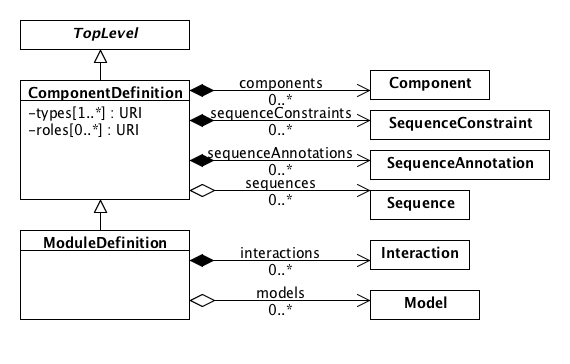

SEP 038 -- Merging ComponentDefinition and ModuleDefinition through Inheritance Pattern
===================================

SEP                     | 038
----------------------|--------------
**Title**                | Merging ComponentDefinition and ModuleDefinition through Inheritance Pattern
**Authors**           | Bryan Bartley (<bartleyba@sbolstandard.org>)
**Editor**            |  
**Type**               | Data Model
**SBOL Version** | 2.4/3.0
**Replaces**        | 
**Status**             | Draft
**Created**          | 28-August-2019
**Last modified**  | 

## Abstract

This proposal will make `ModuleDefinition` a subclass of `ComponentDefinition`, effectively merging `ModuleDefinition` into `ComponentDefinition`. This includes a migration path for deprecating the extraneous and redundant properties of `ModuleDefinition`.  This is an intermediate step to enable transition to SBOL 3.0

## Motivation 

The goal here is in keeping with the spirit of SEP035, and all of the following still applies:

> Similarly, the boundary between structural and functional composition is often unclear, and can cause miscategorizations that are problematic to correct.  For example, we are using `ModuleDefinition` to represent mixtures (e.g., growth media) while `ComponentDefinition` is used to represent covalently bonded structures (e.g., DNA, pure chemicals).

> In short, there doesn't seem to be any value to separating structure and function, so we are going to let one object contain both types of information.

Another important point that motivates the approach advocated in this SEP is that it will help harmonize the SBOL data model with SBOL visual, so that the semantics map better from one standard to another. We will discuss this again in a moment.

The most important difference between this SEP and SEP035 is that it allows us to retain an explicit concept representing a module and modularity in the data model, while SEP035 obscures it. In order to harmonize the SBOL data model with SBOL visual, it is important to retain the concept of a module in order to preserve these semantics and harmonize the standards. Modularity is widely recognized as one of the fundamental principles of synthetic biology and engineering. The names we choose for classes in the data model can be important, especially when trying to explain SBOL to new users, journal reviewers, and the larger scientific community.  We should keep this concept explicit in the data model.

A natural language description of this conceptualization is as follows:

_A module is a component of a system that has a specified functional interaction with other components through an interface of inputs and outputs._

## Specification 

**Figure 1:** Diagram of `ModuleDefinition` class as subclass of `ComponentDefinition`

### Adjustments to Component

- The `definition` property of `Component` can now reference either a `ComponentDefinition` or `ModuleDefinition`, thus integrating the previously separate structural and functional hierarchies into a single.
- The `direction` field is moved from `FunctionalComponent` to `Component`

### Adjustments to FunctionalComponent

- `FunctionalComponent` is deprecated

### Adjustments to ModuleDefinition

- `ModuleDefinition` is subclassed from `ComponentDefinition`
- The `modules` property is deprecated. The `components` property is used instead for hierarchical composition.
- The `functionalComponents` property is deprecated.

### Adjustments to Participation

For `Participation` objects, the `participant` property is generalized to allow `ComponentInstance` objects, not just `FunctionalComponent`.

Additional validation rules to add are:

- During the 2.4 transition stage to full deprecation, there may be 2.3 `ModuleDefinitions` using the old `modules` hierarchy that coexist with 2.4 `ModuleDefinitions` using the new `components` hierarchy. There we may need validation rules to enforce consistency between these two options. One possibility is to allow a `ModuleDefinition` to use one or the other hierarchy, but not both simultaneously.
- Like SEP035, a weak REQUIRED condition for `ModuleDefinition`: there must only be a `sequence` or `sequenceAnnotaiton` if all `components` can be linearized onto a single sequence.

## Backwards Compatibility 

Backwards compatibility can be temporarily maintained by retaining all of `ModuleDefinitions` current properties, while going ahead and implementing the inheritance relationship with `ComponentDefinition`.

In SBOL 3, `FunctionalComponent`, and `Module` will all be deleted, which will obviously not be backward compatible, while `ModuleDefinition` will be retained. Once `Modules` and `FunctionalComponents` are fully deprecated, there is still a straightforward conversion from 2.4 to 3.0 `ModuleDefinition`.

## Discussion 

A concern raised is that this change may require type casting triple stores. If necessary, we will demonstrate how easy it is to implement this change using pySBOL and validate it on existing SynBioHub instances. 

## Competing SEPs 

This proposal is in the same spirit as SEP035, though the approach to implementation is different. It accomplishes much of the same as SEP035, because it adds Interactions and Models to ComponentDefinition, thus integrating the structural and functional hierarchies. 

References 
----------------

Copyright 
-------------

  
   
  To the extent possible under law,
  <a rel="dct:publisher"
     href="sbolstandard.org">
    SBOL developers</a>
  has waived all copyright and related or neighboring rights to
  SEP 038.
This work is published from:

  United States.

